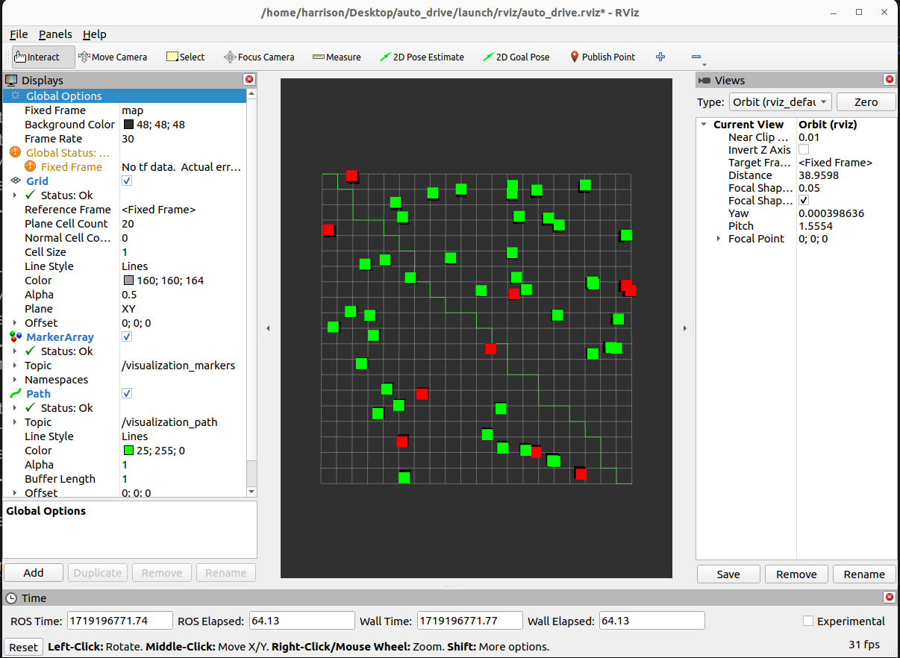

# auto_drive subsystem

An autonomous driving perception and planning system based on ROS2, including obstacle detection, tracking and path planning functions.

Data flow: sensor data -> obstacle detection -> obstacle tracking -> path planning -> control instructions (analog output)



## Table of contents

- [Install](#Install)
- [Use](#Use)
- [Contribution](#Contribution)

## Install

[ROS2 Basic](https://github.com/Erio-Harrison/ros2_basic)


## Use

1. Clone this repository, then:

   ```bash
   cd auto_drive
   ```

2. Build and Run: 

   ```
   colcon build
   ```

   ```bash
   ros2 launch launch/auto_drive_system.launch.py
   ```

3. Edit the configures of `rviz`:
   
- Set Fixed Frame:

    In the "Global Options" in the left panel, set "Fixed Frame" to "map" (or the appropriate frame used in your system)

- Add a MarkerArray display:

    1. Click the "Add" button

    2. Select "MarkerArray"

    3. In the newly added MarkerArray display, set "Topic" to "/visualization_markers"

- Add a Path display:

    1. Click the "Add" button again

    2. Select "Path"
    
    3. In the newly added Path display, set "Topic" to "/visualization_path"

- Adjust the view:

    Use your mouse to adjust the view in RViz so that you can see the elements of the visualization

## Contribution

If anyone wants to add examples based on this, please directly apply for PR.