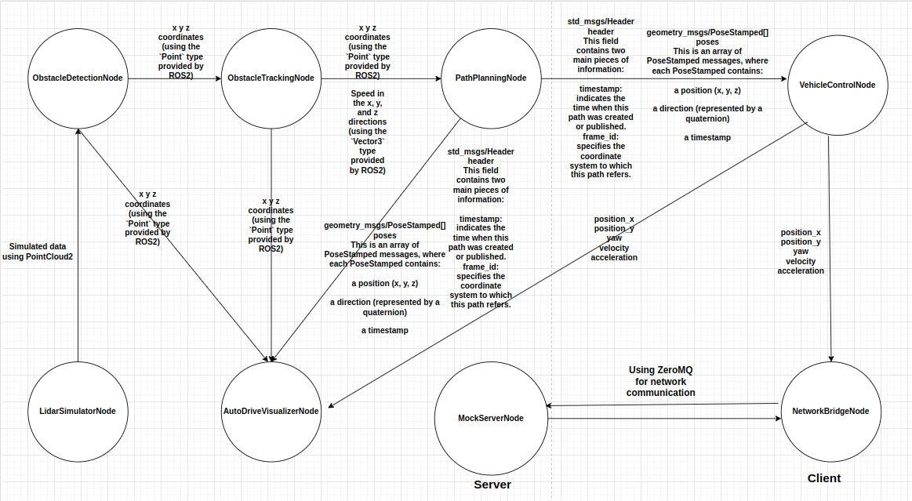
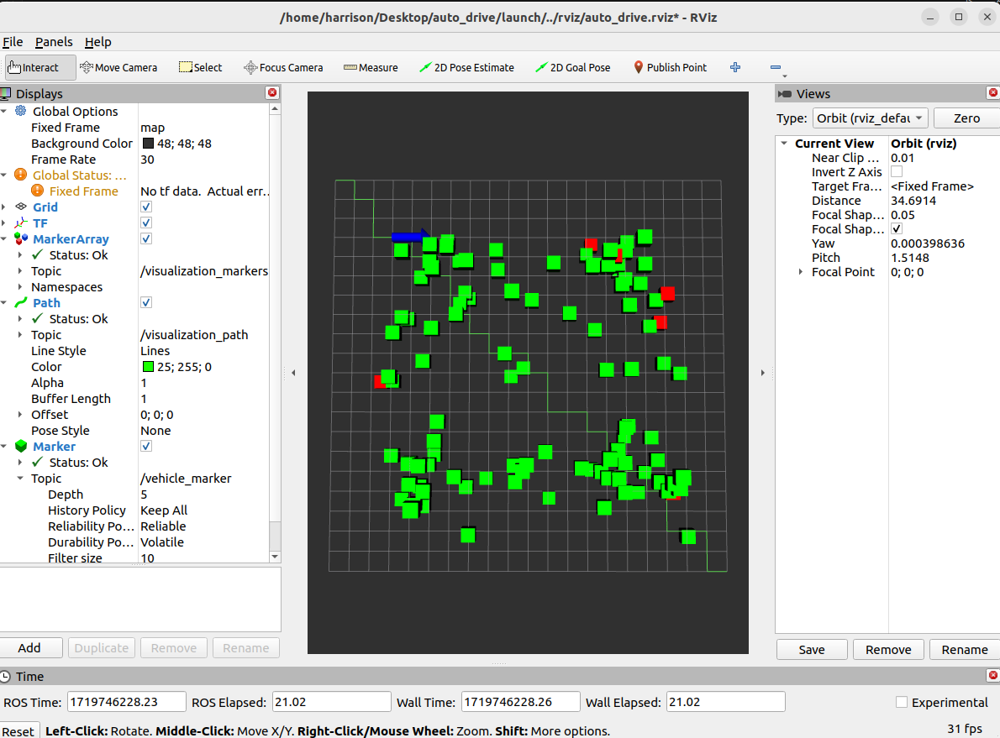

# write-you-an-autopilot-sys

An autonomous driving perception and planning system based on ROS2, including obstacle detection, tracking and path planning functions.

Data flow: sensor data -> obstacle detection -> obstacle tracking -> path planning -> control instructions (analog output)



## Install

[ROS2 Basic](https://github.com/Erio-Harrison/ros2_basic)


## Use

1. Clone this repository, then:

   ```bash
   cd write-you-an-autopilot-sys
   ```
2. We use ZeroMq for network communication:

   ```bash
   sudo apt-get update
   sudo apt-get install libzmq3-dev
   ```

3. Build and Run: 

   ```
   colcon build
   ```

   ```bash
   ros2 launch launch/auto_drive_system.launch.py
   ```

   You may see something like this:



## Contribution

If anyone wants to add examples based on this, please directly apply for PR.

## License Statement

Note: The content of this tutorial is protected by the Apache License, and the author reserves all copyrights.