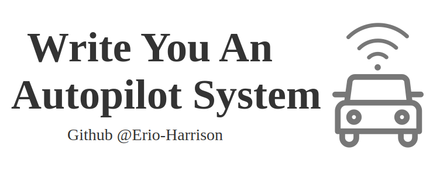

# Write-You-An-Autopilot-System

This is a tutorial that teaches you how to build an autonomous driving system step by step. You can copy the code directly, but the better way is to follow along.

# Tutorial

[Come here to go through the tutorials](https://github.com/Erio-Harrison/write-you-an-autopilot-sys/tree/master/tutorial)

# Environment

`Ubuntu 22.04.4 LTS` and `ROS2 (Robot Operating System 2)`

# Demo

1. Clone this repository, then:

   ```bash
   cd write-you-an-autopilot-sys
   ```
2. We use ZeroMq for network communication:

   ```bash
   sudo apt-get update
   sudo apt-get install libzmq3-dev
   ```

3. Build and Run: 

   ```
   colcon build
   ```

   ```bash
   ros2 launch launch/auto_drive_system.launch.py
   ```

   You may see something like this:


# License Statement

Note: The content of this tutorial is protected by the Apache License, and the author reserves all copyrights.